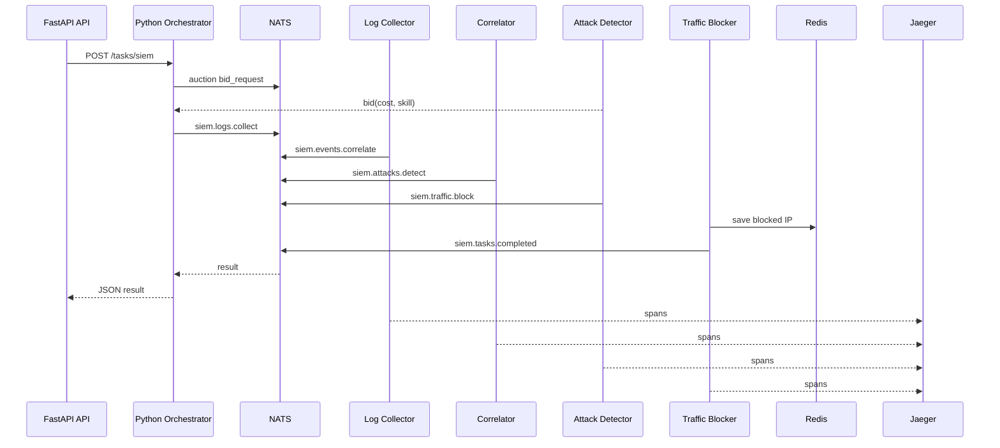

# LR-13

# Лабораторная работа №13: Мультиагентные системы: разработка распределённых интеллектуальных агентов

Автор: Гармашов Виталий Валерьевич  
Группа: 221331  
Вариант: 17  
Предметная область: Кибербезопасность (SIEM)  
Уровень: задания повышенной сложности

## Цель

Освоить проектирование и реализацию мультиагентных систем (MAS), где агенты решают задачи из конкретной предметной области, взаимодействуют через брокер сообщений, а оркестратор управляет их работой.

## Реализованная система

Проект представляет собой распределённую SIEM-систему. Go-агенты обрабатывают события безопасности по pipeline, Python-оркестратор запускает задачи, контролирует таймауты и предоставляет REST API.

| Компонент | Язык | Назначение |
|---|---|---|
| `log-collector` | Go | сбор и нормализация логов |
| `event-correlator` | Go | корреляция событий безопасности |
| `attack-detector` | Go | детекция атак и участие в аукционе задач |
| `traffic-blocker` | Go | блокировка подозрительного IP и сохранение состояния в Redis |
| `orchestrator-api` | Python/FastAPI | REST API, запуск pipeline, retry/timeout |
| `llm-agent` | Python | опциональное объяснение инцидента через Ollama |
| NATS | broker | обмен сообщениями |
| Redis | state storage | состояние агента блокировки |
| Jaeger | tracing | распределённая трассировка |

## Выполненные задания повышенной сложности

### 1. Разработка полной системы из 3-5 агентов на Go

Реализованы 4 Go-агента: сбор логов, корреляция событий, детекция атак, блокировка трафика. Каждый агент работает как отдельный микросервис и взаимодействует через NATS.

### 2. Цепочки задач (pipeline)

Реализована последовательная обработка:

```text
siem.logs.collect -> siem.events.correlate -> siem.attacks.detect -> siem.traffic.block -> siem.tasks.completed
```

### 3. Распределённая трассировка (Jaeger)

В Go-агенты и Python-оркестратор добавлен OpenTelemetry. Jaeger поднимается через Docker Compose и доступен на `http://localhost:16686`.

### 4. Агент с состоянием (Redis)

Агент `traffic-blocker` сохраняет заблокированные IP в Redis:

```text
siem:blocked_ips
siem:block_count
siem:last_block:<ip>
```

### 5. Динамическое масштабирование

Подготовлен скрипт `scripts/scale_agents.py`, который масштабирует экземпляры `attack-detector` через Docker Compose. NATS queue groups распределяют задачи между репликами.

### 6. Аукционное распределение задач

Оркестратор публикует запрос `siem.auction.bid_request`, агент детекции возвращает bid с `cost`, `skill`, `availability`. Оркестратор выбирает подходящего исполнителя.

### 7. Интеграция LLM-агента

Добавлен Python LLM-агент `orchestrator/llm_agent.py`. Он может формировать объяснение инцидента через локальную Ollama при заданной переменной `OLLAMA_URL`.

### 8. Веб-интерфейс для мониторинга агентов

FastAPI + Jinja2 панель доступна на `http://localhost:8000/`. Она показывает статус подключения, ожидающие задачи и последние audit events.

## Архитектура



## Структура проекта

```text
lab 13/
├── agents/                 # Go-микросервисы агентов
│   ├── blocker/
│   ├── correlator/
│   ├── detector/
│   ├── log_collector/
│   └── Dockerfile
├── internal/siem/           # общие Go-типы, правила, runtime, тесты
├── orchestrator/            # Python-оркестратор, FastAPI, LLM-агент
├── scripts/                 # демо-запрос и масштабирование
├── tests/                   # pytest для оркестратора
├── web/templates/           # HTML-панель мониторинга
├── docs/                    # описание ролей агентов
├── docker-compose.yml
├── Dockerfile.python
├── go.mod
├── requirements.txt
├── pytest.ini
├── PROMPT_LOG.md
└── README.md
```

## Быстрый старт

```powershell
docker compose up --build
```

После запуска доступны:

- API и мониторинг: `http://localhost:8000`
- Swagger: `http://localhost:8000/docs`
- Jaeger: `http://localhost:16686`
- NATS monitoring: `http://localhost:8222`

Демо-запрос:

```powershell
.\scripts\run_demo.ps1
```

Пример ручного запроса:

```powershell
Invoke-RestMethod -Method Post -Uri "http://localhost:8000/tasks/siem" -ContentType "application/json" -Body '{
  "source_ip": "203.0.113.17",
  "host": "vpn-gateway-17",
  "raw_logs": [
    "failed login for admin from 203.0.113.17",
    "failed login for root from 203.0.113.17",
    "failed login for backup from 203.0.113.17",
    "malware signature detected"
  ]
}'
```

## Масштабирование

```powershell
python .\scripts\scale_agents.py --detectors 3
```

## Тестирование

Go-тесты:

```powershell
go test ./...
```

Python-тесты:

```powershell
python -m pip install -r requirements.txt
python -m pytest
```

Проверенный результат:

```text
go test ./...      -> ok
python -m pytest   -> 2 passed
docker compose build -> success
demo request -> attack detected, IP blocked in Redis
```

## Основные файлы

| Файл | Назначение |
|---|---|
| `PROMPT_LOG.md` | журнал промптов и этапов выполнения |
| `docs/agent_roles.md` | роли, входы/выходы и бизнес-правила агентов |
| `tests/test_orchestrator.py` | pytest для Python-оркестратора |
| `internal/siem/rules_test.go` | Go unit-тесты правил SIEM |
| `docker-compose.yml` | инфраструктура NATS, Redis, Jaeger, API и Go-агентов |

# LR-13
